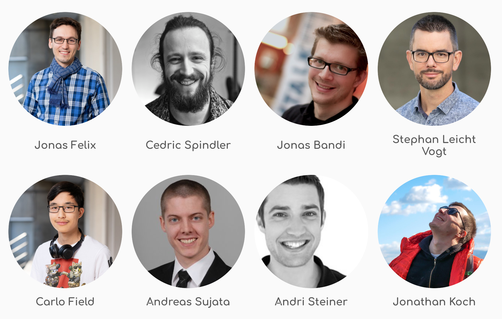

### Welcome to our course
## DevOps: CI/CD with Kubernetes

> Goal: Put an application into containers and deliver it continuously to kubernetes.

Notes:
Let's run applications in containers with docker, orchestrate them in Kubernetes and their integration as well as delivery with Gitlab.

----

### Letsboot Team

<!-- .element style="width: 50%;" -->

Note: 
* letsboot.com started 2016
* Group of Software Engineers providing hands on courses, coaching and consulting.
* Goal: Teach topics we love as hands-on bootup trainings.

----

> skip for workshoptage

## Let's say Hello

* Experience
* Expectations
* Questions

Notes:
* Trainer starts to introduce herself/himself and then everyone says their name, company, background, expectations and questions.

----

## Agenda - Workshoptage 2020:

* Introduction and Setup <small>(00, 01)</small>
* Containers <small>(02)</small>
* Docker Introduction <small>(10, 11)</small>
  * Course project & Docker <small>(15)</small>
* Kubernetes Introduction <small>(20, 21, 22)</small>
  * Course project & Kubernetes  <small>(25)</small>
* CI/CD Introduction <small>(30)</small>
  * Course project & Gitlab-CI <small>(35)</small>

> Tailored/reduced for workshoptage.ch

Notes:
* Focus hands-on playthrough
* View from the developer side of DevOps

* Remove chapters not used before training.
* Introduction to containers using Docker
  * Why Docker?
  * Architecture and concepts
  * Containerization of applications
  * Management of "images" in registries
  * Comparison Container to Virtualization
  * Hands-On use for local development
Container orchestration based on Kubernetes
  * Why Kubernetes?
  * Concepts and Architecture
  * Intersections system engineering / developer
  * Declarative definition of deployments
  * Namespaces, Pods, Services, Deployments
  * Insight into networking and volumes
  * Hands-On setup Deployment for project
  * Simple use of Helm to install complex services (PostgreSQL and RabbitMQ)
  * Playing through scaling and updates
Continuous Integration & Delivery 
  * Basic concepts CI/CD Pipeline
  * Play through CI (Build, Test...) with Docker
  * Creation of CI script based on **Gitlab-CI
  * Extension script by delivery to Kubernetes
  * Delivery to "productive" cluster

----

### COVID-19 Breaks / workshoptage

> please help to stay within the schedule

Foyer 3. floor 

* 10.45 to 11.00  
* 12:45 to 14:00 
* 15.45 to 16.00 
