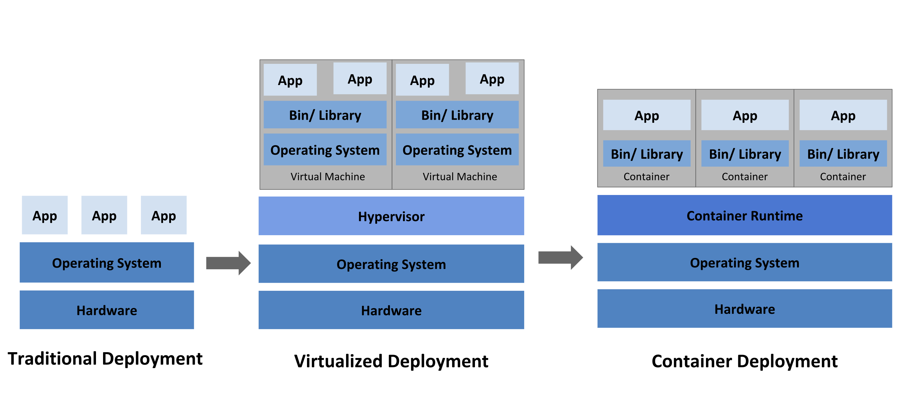

## It's all about 
# Containers

----

### Evolution of
## Running Applications

<!-- .element style="width: 75%;" -->

Note:
* Run all apps on (a) physical machines:
  * Resource conflicts => one app slows down the rest
  * Security
  * environment / version conflicts
  * Time to get a new machine
  * Updating the OS
  * Scaling
  * Run a server per app:
    * bad utilisation, expensive failover
* Use virutalisation
  * separate os and environment
  * isolated applications
  * better/split utilization of servers
  * fast to get a new virtual server
  * overhead (size, bootup time, complexity/updates)
  * philosophically "view from the system up"
* Containers
  * each app is in one container
  * runs directly in the OS (no virtualisation)
  * isolated custom environment
  * can be smaller and faster to deploy
  * starting up means, starting your apps process
  * portable to any compatible system

* everything on a server
* shared hosting
* chroot in shared hosting
* virtualisation
* virtual servers for everything
* containers on servers
* clusters managing containers

----

### What is a container

* a packaged filesystem <small>(image)</small> and instructions how to run it
* an isolated process or group of processes
  * resource restrictions (cpu, memory, network...)
  * separate file system
    * dependencies, configuration, scripts, binaries
  * separate network / ports
  * no direct access or visibility of and to other containers

> a process isolated in it's own environment by the operating system

Note: 
* isolated filesystem based on a container image
* kernel namespaces and cgroups
* your process running as your process
* similar to chroot but with many more features