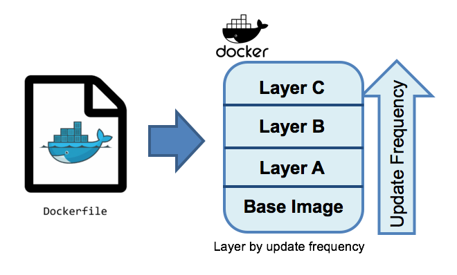

# Docker
### "The" Container Toolset

* 4 Million images

Notes: 
* 4 Million images
* Started 2013. 
* Not the first doing container, but the first doing it well.
* First Release 2013
* Golang
* "Runs" on Linux, Windows, macOS
* Also called "OS-level virtualization"
* Combination of Open Source and Closed Source parts
* Predecesor Dotcloud started 2007
* Started with LXC (Linux Containers) before writing their own Container imlementation
* 68.6k Stacks on Stackshare (vs. ?, 6.2k vagrant)
* main contributors: Docker team, Google, Microsoft, Cisco, Huawei, IBM, and Red Hat.

----

## Docker Overview


```txt
docker-cli -> dockerd (containerd) -> runc -> process
```

Notes:
* docker project has many components 
* changed / separated over time
* most important:
  * docker-cli - cli tool, building images and so on
  * dockerd (containerd) - managing multiple containers and their needs
  * runc - working with the OS to run the process in a container
* hub.docker.com - registry
* docker compose - start/stop multiple containers working together
* docker swarm - manage containers on multiple servers - not often used anymore due to kubernetes

----

## Docker Workflow


<!-- .element style="width:50%" -->

Note:
* You build a docker image
* The image gets run as container
* Images are stored locally 
* Base Images (can) get pulled from the Registry
* You can push your image to the registry
* Images are layered and locally cached (often you only need to download the top image)

----

## Docker Image

1. Choose base image
2. Define changes <small>(copy files, commands to execute)</small>
3. Build as new image


<!-- .element style="width: 40%;" -->

Note: 
* Docker container is a standardized, encapsulated environment that runs applications. A container is managed using the Docker API or CLI.
* Docker image is a read-only template used to build containers. Images are used to store and ship applications.
* Docker service allows containers to be scaled across multiple Docker daemons. The result is known as a swarm, a set of cooperating daemons that communicate through the Docker API.

----

## Build and run our first container

1. todo-app
2. write image configuration (Dockerfile)
2. build image
3. run container from image

----

### Todo App

create: todo-app/Dockerfile
```Dockerfile
FROM node:12-alpine
WORKDIR /app
COPY . .
RUN yarn install --production
RUN echo -e "\033[1;31m this will run on build \033[0m"
CMD ["node", "src/index.js"]
```

Note: 
* FROM refers to the base image
* WORKDIR is the folder in the filesystem we want to work in
* COPY . . copies ./ from our local machine to ./ in our Working directory
* RUN runs a command on build time
* CMD defines how the container should bestarted

----

## build image from Dockerfile

todo-app/
```bash
docker build -t todo-app .
```

* `-t todo-app` tag for your image
* `. ` folder containing the Dockerfile
* downloads layers (will be cached)
* builds image from layers
* runs yarn command

----

## run first docker container

```bash
docker run -d -p 4000:3000 todo-app
docker ps
echo http://$PARTICIPANT_NAME.sk.letsboot.com:4000
```

* `-d` run detached
* `-p` bind host port 4000 to contianer port 3000

----

## update container

change: todo-app/src/static/index.html
```html
...
<body>
    <h1> Some Change </h1>
    ...
```

```bash
cd todo-app/
docker build -t todo-app .
docker run -dp 4000:3000 todo-app
```

> You'll get an error.

Note: 
* We could run another version on a different port.

----

## replace container

```bash
# get the container id 
docker ps

# stop and remove container 
#   or in one step: docker rm -f CONTAINER-ID
docker stop CONTAINER-ID
docker rm CONTAINER-ID

# run it again with a proper name
docker run -dp 4000:3000 todo-app
```

Note: 
* data in the container is gone with the container
* containers can be stoped and started (data stays)
* containers get not updated but replaced

https://docs.docker.com/get-started/overview/


----

# Exercise Mode - first container

> open 10-docker/slides.md


----

## let's use a registry

1. login to hub.docker.com
2. create a repository named 'todo-app': <br/>  https://hub.docker.com/repository/create
3. login and push on terminal

```bash
docker login -u YOUR-USER-NAME
docker image ls
docker tag todo-app YOUR-USER-NAME/todo-app
docker push YOUR-USER-NAME/todo-app
```

4. check your image: <br/> https://hub.docker.com/u/YOUR-USER-NAME

----

## run somewhere else

* go to: http://play-with-docker.com/
* login with docker login 
* click "add new instance" 
* run your image:
```bash
docker run -dp 4000:3000 YOUR-USER-NAME/todo-app
```
* click on the "4000" link
* add somet unique todos

Note: 
* build docker images anywhere
* push them on a registry
* use them anywhere
* we'll use private registries and ci/cd to do that
* keep secretes and custom configuration out of your images

----

## stop and start containers

```bash
# add some todos and then stop the container
docker ps
docker stop CONTAINER-ID1

# start a new container and add some todos
docker run -dp 4000:3000 todo-app

# stop new container and start old one see old todos
docker container ls
docker stop CONTAINER-ID1
docker start CONTAINER-ID2
```

----

# Exercise Mode - registry

> open 10-docker/slides.md


----

## Persistence

Layered filesystem:
1. base image layers - imutable
2. our image layer - imutable
3. individual container layer - bound to the container

Note: 
* All changes are stored in the individual container layer.
* Multiple container from the same image have different data.
* If a container is updated, which means replaced, the date is gone by deleting the old container.

----

## Persistence example

```bash
# create a container with a file (output is container-id)
docker run -d busybox sh -c "hostname > /data.txt && tail -f /dev/null"

# see the file data 
docker exec CONTAINER-ID cat /data.txt

# create a second busybox container and compare the data
docker run -d busybox sh -c "hostname > /data.txt && tail -f /dev/null"
docker exec CONTAINER-ID cat /data.txt

```

Note: 
* each running container has it's own layer for changes
* exec executes a command in a container
* The tail -f is dummy process to keep the container running.
* If the main process of a container stops, the container is stopped.

----

## Named Volumes

Share data with volumes:

```bash
# create volume
docker volume create todo-db

# start todo with volume -v
docker run -dp 4000:3000 -v todo-db:/etc/todos todo-app

# start second container
docker run -dp 4001:3000 -v todo-db:/etc/todos todo-app
```

create todos on both containers and reload to see same data

Note:
* In the /etc/todos is the sqlite database of our app
* This will `mount` the /etc/todos folder of the container to our new volume.
* This works with sqlite on low load - won't work with mysql

----

## Where is the volume

```bash
# show volume
docker volume inspect todo-db

# list files
sudo ls /var/lib/docker/volumes/todo-app/_data
```

> Hint: On Docker Desktop it's with in the virtual server

----

## Bind Mounts - Developer mode

Run code from host in container. 

todo-app/
```bash
# bind mount /app folder to code folder
docker run -dp 4000:3000 \
    -w /app \
    -v "$(pwd):/app" \
    -v todo-db:/etc/todos  \
    node:12-alpine \
    sh -c "yarn install && yarn run dev"
```

Now change index.html of todo-app.

Note:
`-w /app` working directory for current command
`-v "/FULL/PATH/TO/todo-app:/app"` mount host code folder to container /app folder

----

## Watch logs

```bash
docker logs -f CONTAINER-ID
```

----

# Exercise Mode

> open 10-docker/slides.md


----

## recap

```bash
docker build -t tag -f Dockerfile

docker run -d -p HOST_PORT:CONTAINER_PORT IMAGE_NAME \
  -v named-volume:/path/ \ -v /local/path:/host-path \ 

docker volume create todo-db # create volumes

docker ps --all # show all containers

docker rm -f CONTAINER-ID # stop and remove

docker exec -it CONTAINER-ID /bin/bash # enter container

docker logs -f CONTAINER-ID
```

----

## let's have some fun

```bash
docker run -dp 6080:80 dorowu/ubuntu-desktop-lxde-vnc
```

open: http://FIRSTNAME.sk.letsboot.com:6000