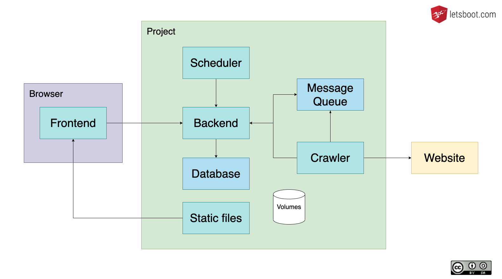

## Course Project in Docker
### Website crawler


<!-- .element style="width:60%" -->

Note:
* backend - core logic and api
* frontend - add websites and see data
* crawler - listens to the queue and crawls website
* scheduler - triggers crawler jobs
* database - store data
* messagequeue - manage jobs in queue

----

## Project folders

project-start/
```txt
.
├── .gitlab-ci.yml
├── README.md
├── build
│   ├── ci
│   └── package
├── cmd
├── config
├── deployments
├── go.mod
├── go.sum
├── internal
└── web
    ├── package.json
    └── yarn.lock
```

Note:
* Recommended mono repo golang project structure.
https://github.com/golang-standards/project-layout

----

## The plan

1. create a network
2. run PostgreSQL image
3. run RabbitMQ image
4. write Dockerfiles <small>for backend, crawler, scheduler and frontend</small>
5. build and run containers
6. push to registry

> the "CI" part of CI/CD <small>exkl. the run part</small>

----

## Create network

```bash
# network for containers talking to each other
docker network create letsboot
```

----

## PostgreSQL

```bash
# postgresql - directly creates database and user
docker run -d \
  --name database \
  --network letsboot \
  -e POSTGRES_PASSWORD="supersecure" \
  -e POSTGRES_USER="letsboot" \
  -e POSTGRES_DB="letsboot" \
  postgres
```
https://hub.docker.com/_/postgres

Hint: No port binding for internal use.

Note:
* we give it a name for docker internal dns
* we want it to run in our container network
* we give it Environment variables specified by the image

----

## RabbitMQ

```bash
# rabbitmq 
docker run -d \
  --name queue \
  --hostname rabbitmq \
  --network letsboot \
  -e RABBITMQ_DEFAULT_PASS="megasecure" \
  -e RABBITMQ_DEFAULT_USER=letsboot \
  rabbitmq
```

Note: 
* The hostname in this case is only for rabbitmq important, for networking we use the --name
* Check: we don't need the port binding if we only want to talk to the queue from other containeers

----

> skip

## Frontend - manual build

project-start/web/
```bash
yarn install
ng serve --host 0.0.0.0 --disable-host-check # ctrl+c to exit
echo open: http://$PARTICIPANT_NAME.sk.letsboot.com:4200/
ng build --prod
ls dist/crawler/
```

----

## Frontend - docker walkthrough

1. use node image
2. copy dependency info
3. install dependencies
4. copy code
5. build app
6. use nginx image
7. copy build to nginx

----

## Frontend - Dockerfile

project-start/build/package/frontend.Dockerfile
```Dockerfile
FROM node:12-alpine AS build
WORKDIR /app
COPY web/yarn.lock .
COPY web/package.json .
RUN yarn install
COPY web/ .
RUN node_modules/.bin/ng build --prod --source-map=false --build-optimizer=false

FROM nginx:alpine
COPY --from=build /app/dist/crawler /usr/share/nginx/html
```

Note:
* From no on we'll keep the Dockerfiles in the build/ci/package folders
* mono repo structure best practice recomendation from golang

----

## Frontend - build and run

project-start/
```bash
docker build -t frontend \
  -f build/package/frontend.Dockerfile .

docker run -d --name frontend \
  --network letsboot -p 4201:80 frontend 

echo open: http://$PARTICIPANT_NAME.sk.letsboot.com:4201/
```

----

> skip

## Backend - run and build manually

```bash
go mod download
go build ./cmd/backend
./backend --db.password="supersecure" \
  --queue.password="megasecure" \
  --db.type=postgres --crawler.data=/tmp/crawler
```

----

## Backend - Dockerfile

build/ci/package/backend.Dockerfile
```Dockerfile
FROM golang:alpine AS build
RUN apk add gcc g++
WORKDIR /app
COPY go.mod .
COPY go.sum .
RUN go mod download
COPY . .
RUN CGO_ENABLED=0 go build -ldflags="-w" ./cmd/backend

FROM scratch
WORKDIR /app 
COPY --from=build /app/backend /app/backend
COPY --from=build /app/config/backend.* .
ENTRYPOINT ["/app/backend"]
```

> `scratch` the (empty) base image of base images

Note:
* we will use a scratch image, as go is statically compiled and doesn't need anything
* As golang is statically compiled we don't need anything else
* we use ENTRYPOINT instead of CMD
  * CMD sets default command which can be overwritten
  * ENTRYPOINT sets binary that will be run (docker command parameter swill be added as parameters)
* Attention: We run this go app in the root context, we'll show how to add a user in a further chapter

----

## Backend - build and run

project-start/
```bash
docker build -t backend \
  -f build/package/backend.Dockerfile .

docker volume create page-storage

docker run -d --name backend -p 8080:8080 \
  -e LETSBOOT_DB.HOST=database \
  -e LETSBOOT_DB.PASSWORD="supersecure" \
  -e LETSBOOT_DB.TYPE="postgres" \
  -e LETSBOOT_QUEUE.PASSWORD="megasecure" \
  -e LETSBOOT_QUEUE.HOST=queue \
  -v page-storage:/var/data \
  --network letsboot backend

echo open: http://$PARTICIPANT_NAME.sk.letsboot.com:8080/sites
```

----

## Test app 

```bash
echo open: http://$PARTICIPANT_NAME.sk.letsboot.com:4201/ 
echo add website
echo check data: http://$PARTICIPANT_NAME.sk.letsboot.com:8080/sites
```

----

### Exercise Mode - multistage

> open 10-docker/slides.md


<!-- .element style="width=50%" -->

----

> skip

## Crawler - run and build manually

```bash
go mod download
go build ./cmd/crawler
./crawler  --queue.password="megasecure" \
  --db.type=postgres --crawler.data=/tmp/crawler
```

----

### Crawler - Dockerfile

build/package/crawler.Dockerfile
```Dockerfile
FROM golang:alpine AS build
RUN apk update && apk add ca-certificates tzdata && update-ca-certificates
WORKDIR /app
COPY go.mod .
COPY go.sum .
RUN go mod download
COPY . . 
RUN CGO_ENABLED=0 go build -ldflags="-w"  ./cmd/crawler

FROM scratch
WORKDIR /app
COPY --from=build /usr/share/zoneinfo /usr/share/zoneinfo
COPY --from=build /etc/ssl/certs/ca-certificates.crt /etc/ssl/certs/
COPY --from=build /app/crawler /app/crawler
COPY --from=build /app/config/crawler.* .
ENTRYPOINT ["/app/crawler"]
```

Notes:
* the crawler needs ssl cert information to connect to websites
* use the smallest possible base image providing what you need
* rethink base image if you need to add to much yourself

----

## Crawler - build and run

project-start/
```bash
docker build -t crawler \
  -f build/package/crawler.Dockerfile .

docker run -d --name crawler  \
  -e LETSBOOT_BACKEND.URL=http://backend:8080 \
  -e LETSBOOT_QUEUE.HOST=queue \
  -e LETSBOOT_QUEUE.PASSWORD="megasecure" \
  -v page-storage:/var/data \
  --network letsboot crawler
```

> no port as the crawler listens to the queue

----

### Crawler - manually invoke crawling

```bash
curl -H "Content-Type: application/json" \
    -X POST -d '{"siteId":1}' \
    http://localhost:8080/crawls

docker logs -f CONTAINER-ID-CRAWLER
```

----

> skip

### run scheduler manually

```bash
curl -X POST http://$PARTICIPANT_NAME.sk.letsboot.com:8080/schedule
```

Note:
* simple example for powerful simple containers 

----

### scheduler

build/package/scheduler.Dockerfile
```Dockerfile
FROM curlimages/curl
CMD curl -X POST $SCHEDULE_URL
```

project-start/
```bash
# build without context
docker build -t scheduler - < build/package/scheduler.Dockerfile 

# this will be run with kubernetes jobs
docker run -e SCHEDULE_URL=http://backend:8080/schedule --network letsboot scheduler

# watch the crawler
docker logs -f crawler
```

Note:
* try `http://backend:8080/sites` to see a result

----

## Private Registry

Push everything to your registry:
```bash
# you are already logged in - that's how you could login into other registries
# docker login registry.fromyou.ch

docker tag backend registry.gitlab.com/$GIT_REPO/backend:latest
docker tag crawler registry.gitlab.com/$GIT_REPO/crawler:latest
docker tag frontend registry.gitlab.com/$GIT_REPO/frontend:latest
docker tag scheduler registry.gitlab.com/$GIT_REPO/scheduler:latest

docker push registry.gitlab.com/$GIT_REPO/backend:latest
docker push registry.gitlab.com/$GIT_REPO/crawler:latest
docker push registry.gitlab.com/$GIT_REPO/frontend:latest
docker push registry.gitlab.com/$GIT_REPO/scheduler:latest

echo "open https://gitlab.com/$GIT_REPO/container_registry"
```

* we already logged you in to your registry

----

### Shutdown everything

```sh
docker stop frontend backend crawler database queue
docker rm frontend backend crawler database queue scheduler
docker network rm letsboot
```

----

### Exercise Mode - multistage

> open 10-docker/slides.md


<!-- .element style="width=50%" -->

----

### recap

* understanding of the course project
* run prebuilt docker images (database, queue)
* create Dockerfiles
* run containers
* push containers to registry
* stop remove containers