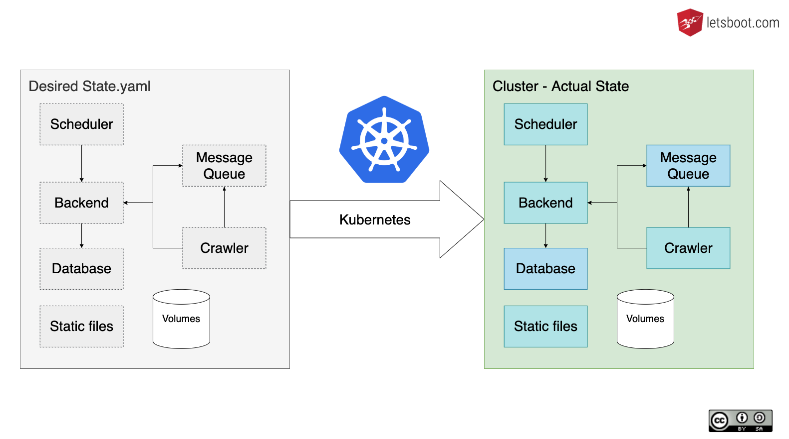

# Kubernetes

<!-- .element style="width:80%" -->

Notes:
* You tell Kubernetes the desired state of your application with it's containers, resources and volumes.
* Kubernetes does the manual container steps automatically, smarter and works towards your desired state. 

----

### What does Kubernetes do

* start container on worker nodes
* monitors health and restarts containers
* replicates containers (scales up)
* optimizes utilisation of all nodes
* rolling updates to replace containers with new versions
* provides containers with volumes (and resources)
* provides networking between containers
* bundles access to multiple containers in services (load balancing)
* ...

----

### What Kubernetes doesn't do

* manage underlying infrastructure
* "manage" storage or backup
* make an application scalable
* manage external dns or networking
* ...

----

# Kubernetes Overview

<!-- .element style="width:80%" -->

Notes:
* One or multiple servers (nodes) run as Master with the so called control plane
* Control-Plan runs containers of kubernetes which manage the cluster
* Each worker node runs a process managing the containers on it 
* Each worker node runs kube proxy to enable communication between nodes and containers

----

### Ways to manage desired state

| | | |
|---|---|---|
| Imperative commands | Live objects |
| Imperative object configuration | Individual files |
| Declarative object configuration | Directories of files |

Note:
* https://kubernetes.io/docs/concepts/overview/working-with-objects/object-management/