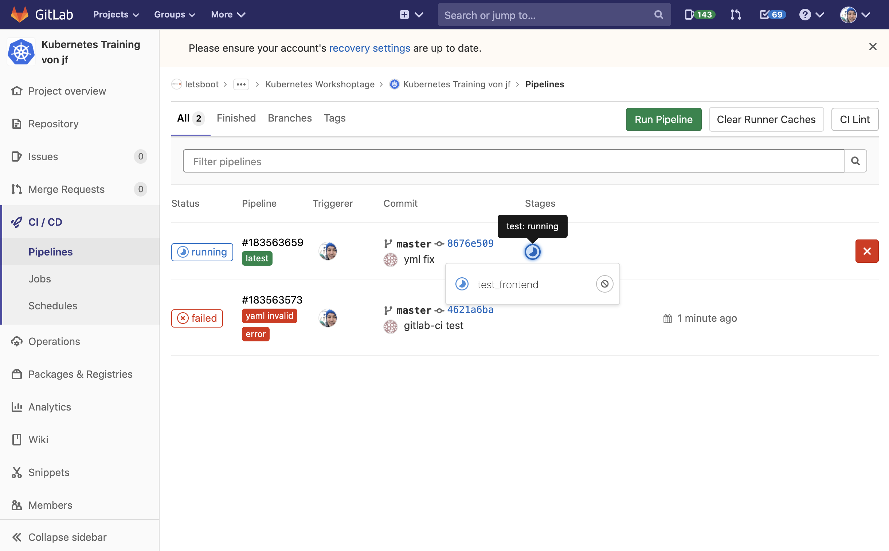

# CI/CD our project

1. build contianers
2. push containers to registry
3. deliver new versions to the cluster

----

## basic frontend example

Goal:
* build frontend
* publish static build to surge

What we do:
1. add secrets / environment variables for surge
2. create gitlab-ci yaml file
3. use node image
4. build angular
5. use surge to deliver

----

## protected variables in gitlab-ci

1. open cicd
```bash
echo "open https://gitlab.com/$GIT_REPO/-/settings/ci_cd"
```
2. expand variables
3. add two variables
  * select protected and masked for both
  * Key: SURGE_EMAIL Value: info.k8s-training@letsboot.com
  * key: SURGE_TOKEN Value: b6d32aa97f8337563b6c351b03832674

----

## replace solution .gitlab-ci.yml with yours

/.gitlab-ci.yml (course level)
```yaml
include:
# - local: project-solution/.gitlab-ci.yml
- local: project-start/.gitlab-ci.yml
```

----

## minimal frontend surge example

project-start/.gitlab-ci.yml
```yaml
surge_demo:
  image: node:12
  script:
    - cd project-start/web
    - yarn install
    - yarn add surge
    - node_modules/.bin/ng build --prod
    - node_modules/.bin/surge -p dist/crawler/ --domain $CI_PROJECT_NAME-k8s-training.surge.sh
```

```bash
git add -A
git commit -m 'push gitlab-ci will trigger ci/cd'
git push
echo "open https://gitlab.com/$GIT_REPO/-/pipelines"
```

> check pipeline for url

----

## check ci/cd process



----

## test stage - frontend

project-start/.gitlab-ci.yml
```yaml
stages:
- test
- build
- deploy

test_go:
  stage: test
  image: golang
  script:
    - cd project-solution
    - export GO111MODULE=on
    - go mod download
    - go test ./...
```

> all golang parts can be tested at once

----

## test stage - frontend

project-start/.gitlab-ci.yml
```yaml
#...

test_frontend:
  stage: test
  image: trion/ng-cli-karma
  script:
    - cd project-solution/web
    - yarn install
    - ng test --progress false --watch false
```

----

## build stage - backend

* we use docker in docker to build our app

project-start/.gitlab-ci.yml
```yaml
#...
build_backend:
  variables:
    APP: backend
  stage: build
  tags: [ docker ]
  image: docker:stable
  services:
  - docker:dind
  before_script:
  - docker login -u gitlab-ci-token -p $CI_JOB_TOKEN $CI_REGISTRY
  script:
  - docker build -t $CI_REGISTRY_IMAGE/$APP:$CI_COMMIT_SHORT_SHA -f project-solution/build/package/$APP.Dockerfile project-solution/
  - docker push $CI_REGISTRY_IMAGE/$APP:$CI_COMMIT_SHORT_SHA
  - echo $CI_REGISTRY_IMAGE/$APP:$CI_COMMIT_SHORT_SHA
```

```bash
echo "open https://gitlab.com/$GIT_REPO/container_registry"
```

----

## Build

1. copy snipped for frontend, crawler and scheduler
2. replace variable.APP 

```yaml
#...
build_frontend:
  variables:
    APP: frontend
#...
build_crawler:
  variables:
    APP: crawler
#...
build_scheduler:
  variables:
    APP: scheduler
```

----

## Run - Continuous Integration

```bash
git add -A
git commit -m 'test, build and push containers'
git push
echo "open https://gitlab.com/$GIT_REPO/-/pipelines"
```

----

> skip (is done automatcially)

## set google service account

1. get prepared service account and open gitlab ci/cd 
```bash
cat ~/google-service-account.json

echo "open https://gitlab.com/$GIT_REPO/-/settings/ci_cd"
```
2. expand variables
3. add two variables
  * select protected and masked for both
  * Key: $GCR_KEY Value: content from file

----

## Deployment 

get cluster name
```bash
echo $KUBERNETES_CLUSTER
```

project-start/.gitlab-ci.yml
```yaml
#...
deploy_all:
  variables:
    CLUSTER_NAME: training-k8s-wst-jonasf-cluster
  stage: deploy
  tags: [ docker ]
  image: google/cloud-sdk:alpine
  before_script:
    - curl -s "https://raw.githubusercontent.com/kubernetes-sigs/kustomize/master/hack/install_kustomize.sh" | bash
    - echo $GCR_KEY > ${HOME}/gcloud-service-key.json
    - gcloud auth activate-service-account --key-file=${HOME}/gcloud-service-key.json
    - gcloud components install kubectl
    - gcloud container clusters get-credentials $CLUSTER_NAME --region europe-west6 --project letsboot
  script:
    - sed -i.bak -E "s/(frontend|backend|scheduler|crawler):latest/\1:$CI_COMMIT_SHORT_SHA/" project-start/deployments/*/*.yaml
    - kubectl apply -f project-start/deployments --recursive
```

Note:
* example how to replace :latest with sed inplace without kustomize

----

## Run - Continuous Delivery

```bash
git add -A
git commit -m 'test, build and push containers'
git push
echo "open https://gitlab.com/$GIT_REPO/-/pipelines"
```

----

## Versions - Kustomize

project-start/deployments/kustomization
```yaml
resources:
  - deployments/database/service.yaml
  - deployments/database/deployment.yaml
  - deployments/database/pvc.yaml
  - deployments/frontend/deployment.yaml
  - deployments/frontend/service.yaml
  - deployments/ingress.yaml
  - deployments/crawler/deployment.yaml
  - deployments/crawler/pvc.yaml
  - deployments/scheduler/cronjob.yaml
  - deployments/backend/deployment.yaml
  - deployments/backend/service.yaml
  - deployments/namespace.yaml
  - deployments/queue/service.yaml
  - deployments/queue/deployment.yaml
```

----


